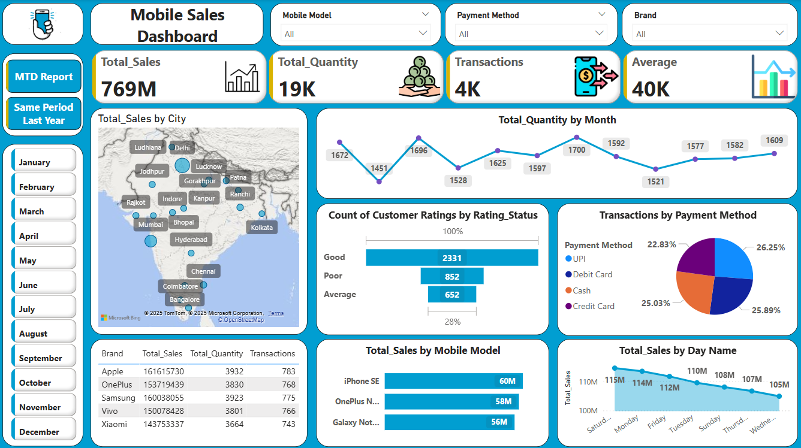
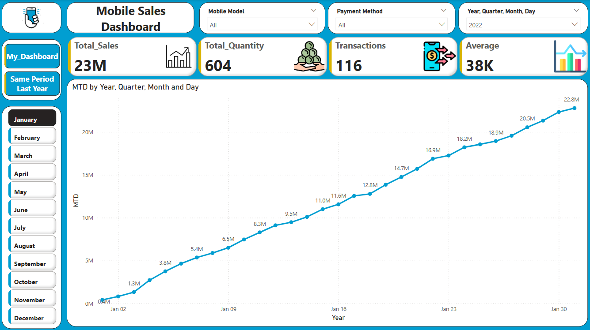
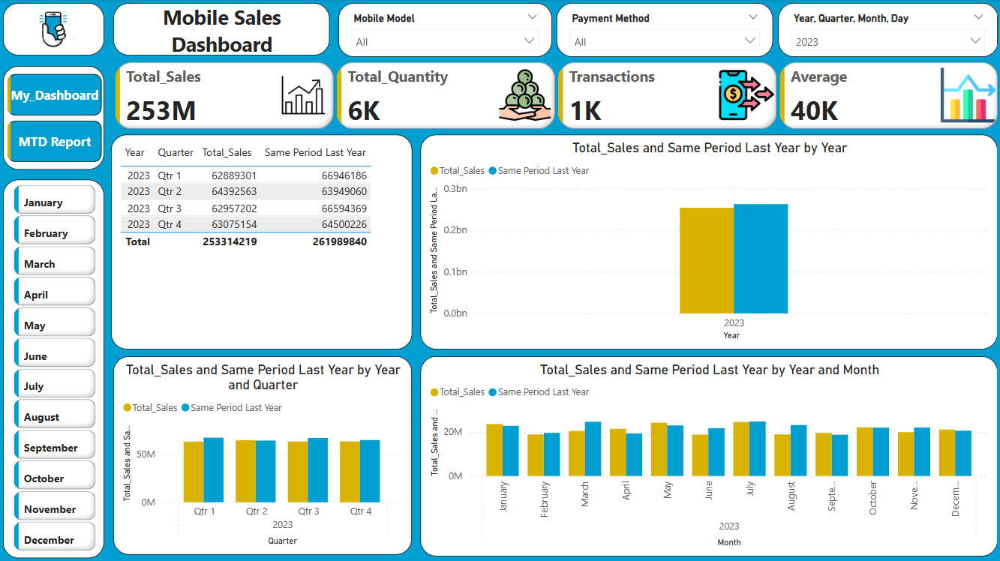

# 📊 Mobile Sales Dashboard – Power BI

**Tools Used:** Power BI, DAX, Power Query  
**Dataset:** Mobile sales transactions with customer details, product info, pricing and feedback  
**Certificate:** [Power BI Course Certificate](./Power BI Course Certificate.pdf)

---

## 🔍 Project Overview

This project visualizes mobile sales data from various cities and brands using Power BI. The dashboard presents key metrics such as Total Sales, Average Price, Quantity Sold and Number of Transactions. It allows filtering by Brand, City, Year, Quarter and Payment Method using interactive slicers.

---

## 🧠 Key Features

- 📈 **DAX Measures:** Month-to-Date (MTD), Same Period Last Year (SPLY)
- 🗂️ **Slicers:** Brand, City, Payment Method, Year, Quarter
- 📊 **Visuals:** Bar, Pie, Line and Map Charts + KPI Cards
- 📁 Structured across multiple pages with clean layout and filters
- 📌 Designed for clear performance tracking and business reporting

---

## 📷 Dashboard Screenshots

  
  
  

---

## 📁 Files Included

- `My_Dashboard - PBI.pbix` – Power BI dashboard file  
- `Mobile Sales Data.xlsx` – Sales data used in the report  
- `Power BI Course Certificate.pdf` – Course completion certificate  
- `My_Dashboard.png` – Dashboard preview image  

---

## 🔗 More

This project was completed as part of a certified Power BI course by [Mr. Satish Dhawale – Founder and CEO @ Skill Course].

